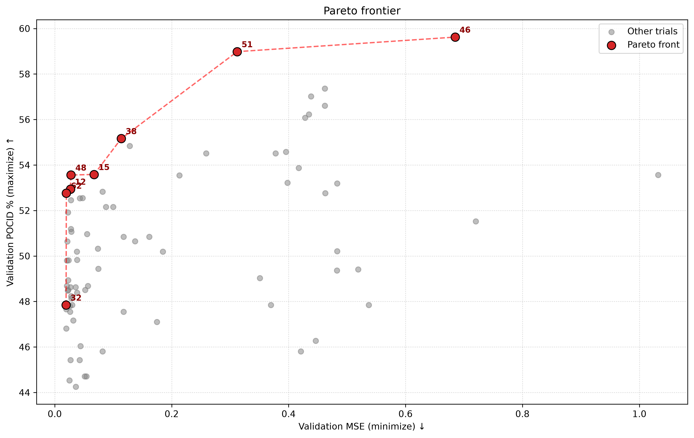
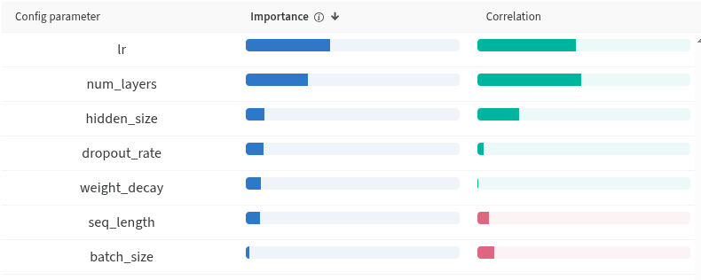
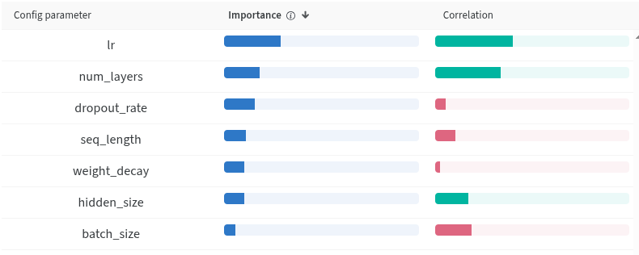
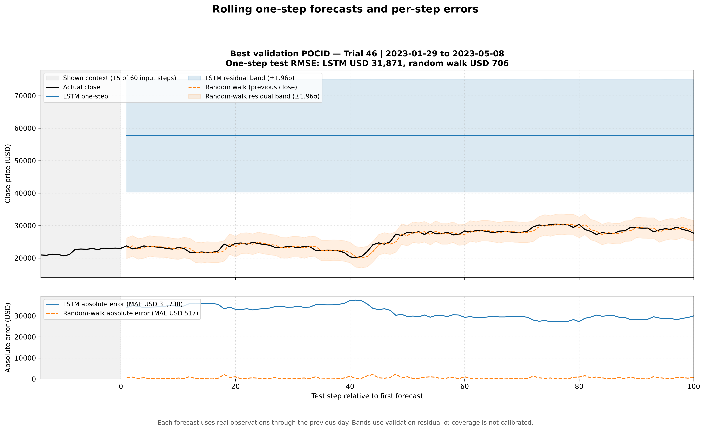
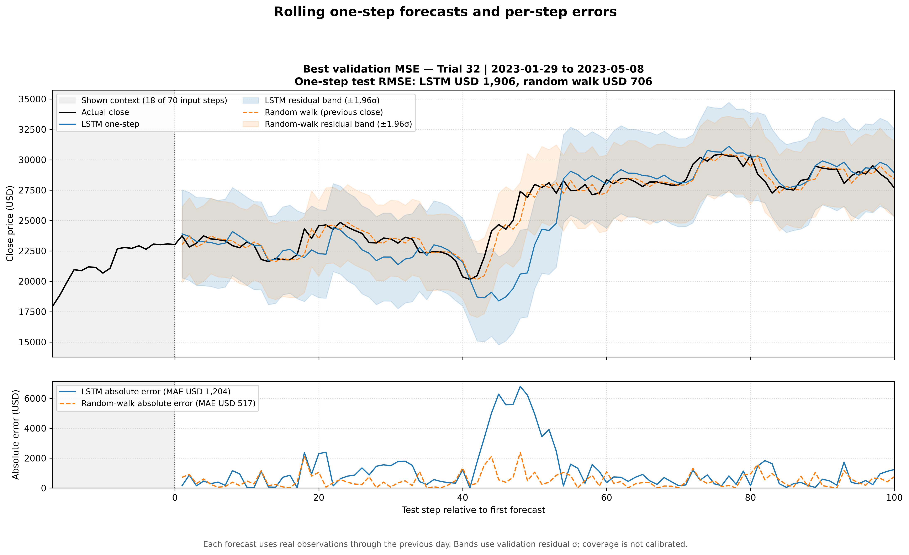

# Previsão do preço do Bitcoin com LSTM

Projeto da disciplina **IF702 (Centro de Informática — UFPE)** para prever o próximo preço diário de fechamento do Bitcoin a partir de uma janela de observações anteriores. O trabalho compara **erro de preço** e **acerto da direção** durante a seleção de uma rede LSTM, usando Optuna para a busca de hiperparâmetros e Weights & Biases (W&B) para registrar os experimentos.

O resultado central é um conflito entre objetivos: o modelo com menor MSE de validação não é o que alcança o maior POCID. A avaliação no conjunto de teste também mostra que o maior POCID de validação, isoladamente, não garante previsões de preço úteis.

## Sumário

1. [Objetivo e dados](#objetivo-e-dados)
2. [Pipeline e modelo](#pipeline-e-modelo)
3. [Métricas e seleção](#métricas-e-seleção)
4. [Experimentos e resultados de validação](#experimentos-e-resultados-de-validação)
5. [Por que o melhor POCID aparece como uma linha reta?](#por-que-o-melhor-pocid-aparece-como-uma-linha-reta)
6. [Avaliação no teste](#avaliação-no-teste)
7. [Limitações e pontos de atenção](#limitações-e-pontos-de-atenção)
8. [Como executar](#como-executar)
9. [Estrutura do repositório](#estrutura-do-repositório)

## Objetivo e dados

O alvo é o **`close` do dia seguinte**. Para cada previsão, a LSTM recebe os `seq_length` dias anteriores com cinco atributos: `open`, `high`, `low`, `close` e `number_of_trades`. O arquivo [`data/data-bitcoin_timedata-2023_v2.csv`](data/data-bitcoin_timedata-2023_v2.csv) contém **2.176 registros diários**, de **17/08/2017 a 01/08/2023**, sem valores ausentes nessas colunas.

Os registros são ordenados por data e divididos cronologicamente em **65% para treino, 15% para validação e 20% para teste**. O `StandardScaler` é ajustado somente no treino e aplicado aos demais conjuntos. As janelas são construídas **dentro de cada partição**, de modo que os primeiros `seq_length` registros da validação e do teste servem como histórico e não são alvos avaliados. Os `DataLoader`s usam `shuffle=False`.

## Pipeline e modelo

O pipeline está em [`src/data_loader.py`](src/data_loader.py). A arquitetura em [`src/model_lstm.py`](src/model_lstm.py) contém uma LSTM parametrizável seguida de uma camada linear: o último estado temporal da sequência é transformado em **um valor normalizado de fechamento**. O dropout interno da LSTM só é aplicado quando há mais de uma camada; por isso, `dropout_rate` não tem efeito sobre uma LSTM de uma camada nesta implementação.

O treinamento usa **AdamW** e escolhe entre `MSELoss` e `L1Loss` como função de perda. Independentemente da perda usada para atualizar os pesos, o objetivo de erro informado ao Optuna é sempre o **MSE de validação na escala normalizada**. Para as métricas em USD, o `close` previsto e o observado são desnormalizados com os parâmetros da coluna `close` do scaler de treino.

## Métricas e seleção

- **MSE de validação:** média de `(previsão normalizada − valor real normalizado)²`; menor é melhor. Os números dessa métrica **não estão em USD²**.
- **MAE, RMSE e MAPE:** medem, respectivamente, erro absoluto médio, raiz do erro quadrático médio e erro percentual médio. São calculados após a desnormalização.
- **POCID** (*Percentage of Correct Directional Predictions*): porcentagem de pares consecutivos em que a mudança prevista e a mudança observada têm o mesmo sinal. Maior é melhor.

Para alvos `y₁, …, yₙ` e previsões `ŷ₁, …, ŷₙ`, a implementação em [`src/metrics.py`](src/metrics.py) calcula:

```text
POCID = 100 / (n − 1) × Σ 𝟙[(yₜ − yₜ₋₁) × (ŷₜ − ŷₜ₋₁) > 0], para t = 2, …, n.
```

Uma variação exatamente zero não conta como acerto. Essa definição compara **previsões de dias consecutivos entre si**; ela não verifica diretamente se cada `ŷₜ` ficou acima ou abaixo do **fechamento real do dia anterior**. Portanto, o POCID deste projeto deve ser lido como concordância das variações entre duas séries, não como uma taxa de acerto de decisões de compra e venda.

Há ainda `directional_accuracy` no módulo de métricas, mas ele trata empates de forma diferente e **não é** o objetivo direcional do estudo. O tempo de inferência reportado é a média por batch durante a validação, dependente do hardware e do tamanho do batch.

## Experimentos e resultados de validação

O estudo multiobjetivo em [`train_lstm2.py`](train_lstm2.py) minimiza o MSE e maximiza o POCID com o `TPESampler` do Optuna. Cada trial pode treinar por até **50 épocas**; o treinamento para após **8 épocas** sem melhoria em nenhum dos objetivos: redução de MSE maior que `1e-4` ou aumento de POCID maior que `0,5` ponto percentual. O W&B registra métricas por época e salva um checkpoint para a melhor época por MSE e outro para a melhor época por POCID. Uma execução do script acrescenta **30 trials** ao estudo SQLite existente; os resultados apresentados aqui são de uma rodada acumulada que inclui os trials #62 e anteriores.

| Hiperparâmetro | Espaço de busca |
| --- | --- |
| Taxa de aprendizado (`lr`) | `1e-4` a `1e-2`, escala logarítmica |
| Unidades ocultas | 32, 64, 128 ou 256 |
| Camadas LSTM | 1 a 3 |
| Tamanho do batch | 16, 32 ou 64 |
| Dropout | 0 a 0,4 |
| `weight_decay` | `1e-6` a `1e-2`, escala logarítmica |
| Janela temporal | 15, 30, 60, 70 ou 90 dias |
| Perda de treino | `MSELoss` ou `L1Loss` |

**Melhores objetivos individuais na validação:** trial **#32**, MSE **0,019402**; trial **#46**, POCID **59,62%**. A fronteira de Pareto resume as alternativas não dominadas entre esses dois objetivos:

| Trial | MSE val. ↓ | POCID val. ↑ | Inferência (s/batch) | Janela | Unidades | Camadas | Papel |
| ---: | ---: | ---: | ---: | ---: | ---: | ---: | --- |
| 12 | 0,026813 | 52,94% | 0,001121 | 70 | 128 | 1 | Compromisso entre erro, direção e tempo |
| 15 | 0,067329 | 53,58% | 0,002149 | 60 | 128 | 2 | Mais POCID que #12, com maior erro |
| 32 | **0,019402** | 47,84% | 0,001068 | 70 | 128 | 1 | Menor MSE |
| 38 | 0,113747 | 55,16% | **0,000507** | 15 | 32 | 3 | Inferência mais rápida entre os listados |
| 46 | 0,684767 | **59,62%** | 0,005094 | 60 | 256 | 2 | Maior POCID |
| 48 | 0,027697 | 53,56% | 0,001251 | 30 | 256 | 1 | Compromisso intermediário |
| 51 | 0,312057 | 58,98% | 0,001170 | 30 | 256 | 1 | POCID alto com erro elevado |
| 62 | 0,019848 | 52,77% | 0,002803 | 90 | 256 | 1 | MSE próximo ao de #32 com POCID maior |

Todos os oito trials listados usaram `batch_size=16` e `MSELoss`. Os demais hiperparâmetros variaram conforme a busca e ficam registrados no estudo. **A tabela combina o melhor MSE e o melhor POCID de cada trial, que podem ocorrer em épocas e checkpoints diferentes.** Assim, ela compara objetivos do trial, não necessariamente duas métricas medidas no mesmo conjunto de pesos. Por exemplo, ao recarregar o checkpoint de melhor POCID do trial #46, seu MSE de validação é cerca de **0,870**, enquanto **0,684767** é o melhor MSE obtido em outra época desse trial.

| Trial selecionado | `lr` | Dropout | `weight_decay` | Configuração |
| --- | ---: | ---: | ---: | --- |
| #32, menor MSE | 0,001473 | 0,226671 | `5,7827e-5` | 70 dias, 128 unidades, 1 camada, batch 16, MSELoss |
| #46, maior POCID | 0,007389 | 0,304218 | `1,1116e-4` | 60 dias, 256 unidades, 2 camadas, batch 16, MSELoss |



Os gráficos abaixo mostram a importância e a correlação dos hiperparâmetros nas *runs* de **validação** selecionadas para a análise. A taxa de aprendizado aparece como influência importante nos dois objetivos. Essas associações são descritivas e não demonstram causalidade; também não representam desempenho no teste.

| MSE de validação | POCID de validação |
| --- | --- |
|  |  |

## Por que o melhor POCID aparece como uma linha reta?

O checkpoint escolhido pelo **maior POCID de validação** é o do trial **#46**. No recorte de **100 previsões de um passo** do teste, entre **29/01/2023 e 08/05/2023**, ele produziu preços entre aproximadamente **USD 57.665 e USD 57.682**: uma amplitude de apenas **USD 17**. Os fechamentos observados nesse trecho variaram aproximadamente de **USD 20.151 a USD 30.467**. Na escala vertical do gráfico, a oscilação prevista fica imperceptível, por isso a curva azul parece uma linha horizontal. **Ela não é matematicamente constante:** as 99 diferenças entre previsões sucessivas nesse trecho são não nulas.

Isso explica **por que o POCID ainda funciona matematicamente** nesse caso. A fórmula usa apenas o **sinal** das variações; uma mudança de poucos dólares pode contar da mesma forma que uma mudança de milhares de dólares. Além disso, um deslocamento constante em todos os valores previstos não altera o POCID. Assim, o modelo pode concordar com parte dos sinais das oscilações e errar gravemente o patamar do preço. O **59,62% foi alcançado na validação**, não nesse recorte de teste: ao aplicar a mesma fórmula às 100 previsões do gráfico, o POCID é aproximadamente **52,53%**. Ser o *melhor POCID* significa apenas ser o maior valor **entre os trials avaliados na validação**, não ser o melhor previsor de preços ou uma estratégia de negociação validada.

O gráfico mostra ainda o tamanho do erro: o modelo fica perto de USD 57,7 mil quando o mercado está perto de USD 20–30 mil. O MSE alto já sinalizava essa falha. O padrão é compatível com uma previsão de nível quase constante e dificuldade de generalizar para esse período, mas os resultados disponíveis **não isolam uma causa única** para esse comportamento.



## Avaliação no teste

O script [`compare_one_step.py`](compare_one_step.py) recarrega os dois checkpoints escolhidos na validação e compara **100 previsões móveis de um passo à frente** com o baseline de *random walk*: o fechamento observado no dia anterior. Cada previsão usa observações reais disponíveis até o dia anterior; o procedimento **não** faz uma projeção recursiva de 100 dias. As métricas abaixo são do arquivo [`test_results/prediction_intervals_metrics_03_10.csv`](test_results/prediction_intervals_metrics_03_10.csv), no período de **29/01/2023 a 08/05/2023**.

| Seleção na validação | Modelo no teste | RMSE (USD) ↓ | MAE (USD) ↓ |
| --- | --- | ---: | ---: |
| Menor MSE, trial #32 | LSTM | 1.906,10 | 1.203,72 |
| Menor MSE, trial #32 | Fechamento anterior | **705,80** | **517,40** |
| Maior POCID, trial #46 | LSTM | 31.871,20 | 31.737,58 |
| Maior POCID, trial #46 | Fechamento anterior | **705,80** | **517,40** |

O baseline é idêntico nas duas comparações porque usa o mesmo período e o mesmo fechamento anterior. **Nenhum dos dois checkpoints supera esse baseline em MAE ou RMSE nesse recorte.** O trial #32 acompanha o nível de preço melhor que o #46, mas ainda tem erro maior que o fechamento anterior.



As faixas sombreadas dos gráficos são `previsão ± 1,96 × desvio padrão dos resíduos de validação`. Elas servem para visualizar a dispersão dos resíduos: **não foram calibradas como intervalos de previsão**, portanto não há garantia de cobertura de 95%.

## Limitações e pontos de atenção

- **Seleção pela validação:** escolher o maior POCID entre vários trials pode favorecer um resultado específico desse período. O teste é necessário para avaliar generalização.
- **Nível e direção são problemas diferentes:** POCID ignora a magnitude e o deslocamento das previsões. Uma boa pontuação direcional não compensa um erro de preço de dezenas de milhares de dólares.
- **Definição operacional de direção:** para medir se uma previsão indica corretamente subida ou queda em relação ao último fechamento conhecido, é preciso comparar `ŷₜ − yₜ₋₁` com `yₜ − yₜ₋₁`; o POCID implementado usa `ŷₜ − ŷₜ₋₁`.
- **Janelas por partição:** os primeiros dias de validação e teste são usados apenas como contexto, o que reduz o número de alvos avaliados e pode mudar o período efetivo conforme `seq_length`.
- **Reprodutibilidade:** não há semente fixa para PyTorch/Optuna no script de treino. Uma nova execução pode produzir resultados diferentes; o estudo SQLite existente também acumula novos trials.

## Como executar

Na raiz do repositório, com Python 3 instalado:

```bash
python3 -m venv .venv
source .venv/bin/activate
python -m pip install -r requirements.txt
```

Para repetir a busca de hiperparâmetros, configure antes o acesso ao W&B, pois [`train_lstm2.py`](train_lstm2.py) registra as *runs* no projeto `Proj-IF702/miniprojeto2-bitcoin-lstm`:

```bash
wandb login
python train_lstm2.py
```

O comando cria ou reutiliza `bitcoin_lstm_optuna.db` e executa mais 30 trials. Pode usar GPU CUDA quando disponível. Para recriar os gráficos e o CSV da comparação **local**, os checkpoints dos trials #32 e #46 já devem estar em `checkpoints/files/`:

```bash
python compare_one_step.py
```

É possível ajustar o recorte com `--start AAAA-MM-DD` e `--steps N`. O script [`test.py`](test.py) oferece outra avaliação, mas consulta a API do W&B para escolher e baixar uma *run* com a tag `03/10`; portanto depende de acesso à conta e à rede.

## Estrutura do repositório

```text
.
├── data/data-bitcoin_timedata-2023_v2.csv  # Série histórica diária
├── src/
│   ├── data_loader.py                      # Divisão temporal, escala e janelas
│   ├── model_lstm.py                       # Arquitetura e treino/validação
│   ├── metrics.py                          # Métricas e gráfico de previsões
│   └── utils.py                            # Desnormalização e tempo de inferência
├── train_lstm2.py                          # Busca multiobjetivo com Optuna/W&B
├── test.py                                 # Avaliação baseada em runs do W&B
├── compare_one_step.py                     # Comparação local com random walk
├── plots.py                                # Gráfico da fronteira de Pareto via W&B
├── checkpoints/files/                      # Checkpoints selecionados
├── test_results/                           # Figuras e métricas da avaliação
└── requirements.txt
```

## Conclusão

Na validação, o trial #32 minimiza o erro normalizado, enquanto o #46 maximiza a concordância de direção. O segundo é o **melhor pelo critério POCID definido no projeto**, mesmo gerando uma linha quase reta e um nível de preço incorreto no teste. Nos 100 dias avaliados, o baseline simples do fechamento anterior supera ambos os checkpoints em erro de preço. O projeto ilustra por que uma métrica direcional deve ser interpretada junto com erro de magnitude, definição exata da direção e avaliação fora da validação.
